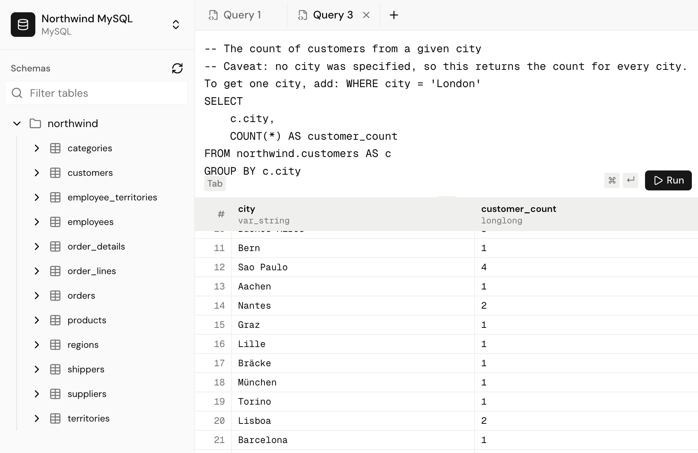
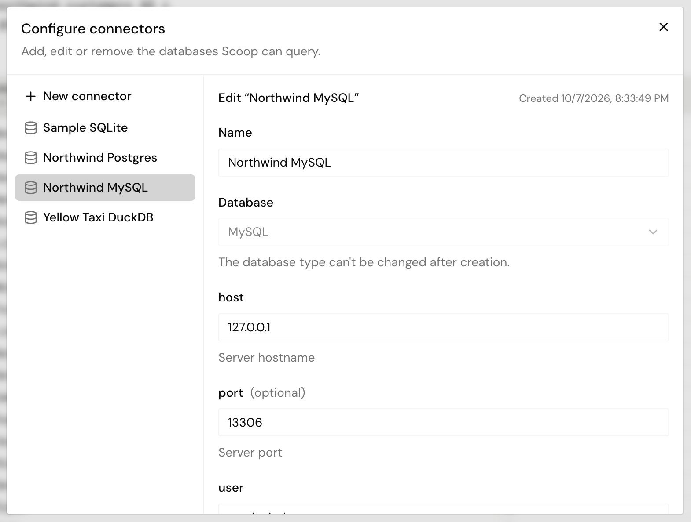

# Scoop

> What's the scoop?

## About

Scoop is an application for connecting to diverse database backends to explore
schemas, tables, and execute queries.



The project is structured in three parts,

```
scoop-api/      # FastAPI server and database connectors
scoop-app/      # NextJS application a'la PgAdmin
scoop-types/    # TypeSpec definitions for all APIs & Models
```

The project uses `just` for simplified command running, you can start each
component with `just run` and you'll get the following,

```
cd scoop-api && just run        # listening on :8000
cd scoop-app && just run        # listening on :3000
```

## Design

Scoop is able to connect to diverse database backends by means of a single
`Connector` abstraction. This interface allows the HTTP API layer to work
against a shared interface, while the actual implementation for Postgres and
MySQL differs greatly. You will notice that this is the same pattern used by
JDBC. Here is the `Connector` definition.

```python
class Connector(ABC):
    @abstractmethod
    def list_tables(self, namespace: TablePath = ()) -> list[TablePath]:
        """List tables and views whose path starts with `namespace`."""

    @abstractmethod
    def get_table(self, path: TablePath) -> Table:
        """Describe a table or view; raises TableNotFoundError if it doesn't exist."""

    @abstractmethod
    def execute(self, query: str, params: Params = None, *, page_size: int = 1000) -> Result:
        """Run `query` with DB-API style `params`, returning pages of at most `page_size` rows."""
```

The `list_tables` and `get_table` APIs allow us to query the information_schema
of the backing database to render the schema and tables in the UI via a
`ListTables` HTTP API, it supports a path for arbitrary namespace/schema nesting
since this is not standardized to two-level.

The more interesting method here is the `execute` method. The `execute` method
takes a query string and returns a `Result` object which is an iterator of
`Page`. I chose a columnar layout for the page so that we need not repeat column
names in each row and bloat the JSON.

```python
@dataclass(frozen=True)
class Page:
    """A batch of rows in columnar form: {column_name: [values...]}."""

    columns: list[Column]
    data: dict[str, list[Any]]

    def __len__(self) -> int:
        return len(self.data[self.columns[0].name]) if self.columns else 0


class Result(ABC, Iterator[Page]):
    """An iterator of result pages. Close it when done."""

    @property
    @abstractmethod
    def columns(self) -> list[Column]: ...

    @abstractmethod
    def __next__(self) -> Page: ...

    @abstractmethod
    def close(self) -> None: ...

    def __iter__(self) -> Self:
        return self
```

This `Connector` interface allows us to write per-database implementations which
need only implement a few methods. You can see them all in these files,

```
connector/
    base.py
    duckdb.py
    mysql.py
    postgres.py
    sqlite.py
```

We have a unified way to query with connectors, but how do we actually
instantiate the connectors? This is where the `ConnectorFactory` comes in. The
`ConnectorFactory` is responisble for unifying the instantiation of connectors
to a single interface; a `ConnectorFactory` receives an abitrary dict of options
(JSON) and instantiates a connector instance. For example, here's the postgres
connector factory.

```python
class PostgresConnectorFactory(ConnectorFactory):
    def kind(self) -> str:
        return "postgres"

    def name(self) -> str:
        return "PostgreSQL"

    def options(self) -> dict[str, Option]:
        return {
            "host": Option(str, "Server hostname"),
            "port": Option(int, "Server port", required=False, default=5432),
            "user": Option(str, "Username"),
            "password": Option(str, "Password", required=False, secret=True),
            "dbname": Option(str, "Database name"),
        }

    def _connect(self, options: dict[str, Any]) -> Connector:
        return PostgresConnector(make_conninfo(**options))
```

This abstraction pays off in two ways. First, we can make a registry of all
factories and create an HTTP API to list all availablel connectors. Beacuse we
have the `options()` method, then our UI can render all the options as a form.
Second, we can save all options JSON into the application database along with
the connector kind. Then when a query comes in we can check a `ConnectorCache`
to see if we have an active connection, otherwise we can use the connector kind
discriminant to lookup the factory in the registry, then use the options to
instantiate the connector.

All the HTTP APIs, defined in `scoop-types/scoop.tsp` - we have Connector CRUD
then we have the Connector APIs as HTTP APIs.

```
GET    /v1/health                    # Service health and version
GET    /v1/connections               # List connector kinds and their options
GET    /v1/connectors                # List saved connectors
POST   /v1/connectors                # Create a connector
GET    /v1/connectors/{id}           # Get a connector
PATCH  /v1/connectors/{id}           # Update a connector
DELETE /v1/connectors/{id}           # Delete a connector
GET    /v1/connectors/{id}/tables    # List tables and views under a namespace
GET    /v1/connectors/{id}/table     # Describe a table or view
POST   /v1/connectors/{id}/execute   # Run a query, returning columnar rows
POST   /v1/connectors/{id}/generate  # Generate SQL from a prompt (SSE stream)
```

The connections API returns a list of all supported connectors along with their
options. The UI does NOT hardcoded any connector information and it's all dynamic
based on the available connectors.



The connector creation saves the connector and its options into the database,
then when we call `execute` we lookup the connector `id` in an object cache. If
the connector is missing from the cache, we instantiate it using the respective
factory. The `execute` API then sends the query to the connector which returns
that `Result` object before. The HTTP layer converts the Result object into a
`Page` of JSON results which the UI renders.

Finally there are end-to-end integration tests against the Docker image containing
the Postgres and MySQL Northwind databases. These integration tests use the HTTP
API to test the full system.

## Prompts

- describing your major prompts and where you redirected the AI

1. Connector Interface

> Our goal is to create a Connector interface for connections to diverse database backends. This should be inspired by JDBC but minimal. We should have metadata APIs for listing tables, getting tables, and then an 'execute' API which takes a query text and returns a 'Result' object (interface) which is an iterator of result pages. Please ask any clarifying questions before continuing.

Comments: Here I knew the exact shape of the API I wanted, and I knew I only
needed minimal metadata and the paginated execute. The clarifying questions is
how I make Claude interview me rather than it making decisions. I had to steer
Claude to get the shape of the Results Page correct by making it columnar rather
than rowwise. I wanted columnar because I knew that I would JSON-ify this later
so wanted a more efficient shape.

2. ConnectorFactory Interface

> Each Connector will require it's own instantiation logic. I want to design a ConnectorFactory which unifies connector instantiation into an interface. This interface should have a 'kind' method and 'name' method, then a method that returns a dict of all the necessary options to instantiate. The instantiation method should take a dict of the options then instantiate the appropriate connector. We do not need to hook this up to any APIs yet.

Comments: I knew that I needed a factory for connectors, and I really cared for
the 'kind' discriminant and 'options' dict. I knew these were going to power
both the UI and the server's connector instantiation. I kept the scope small
because I only wanted the interface + impls. I did not care for hooking this
into any HTTP APIs or even the server. Notably, I do NOT ask for the factory
registry -- that was a major point in the 'kind' choice -- yet Claude put the
registry into the plan and I approved that.

3. HTTP APIs

> Look at connector.py and determine a minimal set of HTTP APIs for Connector CRUD and then interactions with connectors at their scoped endpoints. Each connector will have a UUID so we can address it like '/v1'connector/<uuid>/execute/'

Comments: Once I had the python APIs good, I knew it would be easy for Claude to
raise a set of HTTP APIs. I had already setup the `scoop-types` package with the
codegen, so this was purely writing TypeSpec. I knew I just needed Connector
CRUD with the factories and then an HTTP equivalent of the Connector API which
had already been established. I had to steer the actual implementation of the
Connector CRUD to ensure we stored the connector like, (kind text, options,
jsonb) which Claude did not choose on its own. I wanted this because it's
precisely how we interface with the factory.


4. Connectors in APIs

> Please build a connector cache which cache's a Connector instance by UUID. If there's a cache miss, we lookup in the database and use the respective factory to instantiate this. All connector routes should get the cache via FastAPI dep injection.

Comments: This prompt is how I hooked Connectors into the HTTP API. With this,
each connector route had access to the cache/registry and a means to instantiate
a connector if needed. I was explicit to use the FastAPI dependency injection
patterns to ensure Claude managed state properly. 

5. Scaffold App

> Create a scoop-app NextJS + shadcn project and pull all shadcn components, then configure the scoop-types codegen and create SWR hooks for ALL APIs.

Comments: I used this prompt to scaffold the application. The important thing
was (1) getting ALL shadcn components so we can build without having to pull
each time and (2) configuring codegen and hooks so that we get all models from
the TypeSpec defined earlier and then hooks so we can call the APIs. This prompt
was enough to get a useable application shell. I followed-up by stating to
explore the APIs and recognize this is a PgAdmin like application. That seed was
enough to get a first pass at the UI, with some nudging on where to put
connectors and using a filetree for showing the schemas+tables.

## Future Work

1. Connection Pools

The current setup has only one connector instance that gets re-used by
all queries. I made no attempts at thread safety or being able to handle
concurrent requests. The design is simple and pragmatic, but limited.

2. Proper Cursor Handling

This implementation does not have proper pagination in the API because
it would required pagination tokens and holding cursors in memory. The
pragmatic solution was to cap at 10,000 results and paginate client-side
in the application. This is sufficient for a user-facing application, but
not if the customer truly needs to export all results. I would need to
hold cursors (the Result abstraction) and make the HTTP API's pagination
work with the cursor/Result API.

3. Passwords in the database!!

I made no attempts for proper secret management. We cannot store secrets in the
database. In a proper system, I would store placeholders, like keys, in the
database and use a service like AWS Secrets Manager to load the secrets on the
server during connector instantiation. All ConnectorFactory instances would have
access to a SecretsStore object on which they could resolve the placeholder keys
to the actual secrets before doing a proper connect.

4. Proper Value Encoding

As a shortcut, I just quickly JSON-ified all results, but I know that not all
SQL types are JSON-serializable such as BLOBs. Also, SQL has INTs 128-bit which
are larger than JSON INT (64-bit) yet I made no attempt to have robust value
encoding. Of course, it's mostly good and in 45 minutes it did the trick.

5. Param Placeholders

Each backend uses different syntax for parameters like `?` vs. `$1` and making
a universal solution was too large of a scope in the time allotted. I would 
need to think hard about the most elegant way to approach this. I explicitly
asked Claude to completely ignore parameters to avoid extra complexity when
I wasn't sure of the right design, no did I think it mattered in the moment.

## Support

Scoop currently supports the following database backends. Each one is a
connector in `scoop-api/api/connector/`, registered by its `kind` in
`registry.py`.

| Backend    | Kind       | Library            |
|------------|------------|--------------------|
| DuckDB     | `duckdb`   | `duckdb`           |
| PostgreSQL | `postgres` | `psycopg` 3        |
| SQLite     | `sqlite`   | `sqlite3` (stdlib) |
| MySQL      | `mysql`    | `PyMySQL`          |
